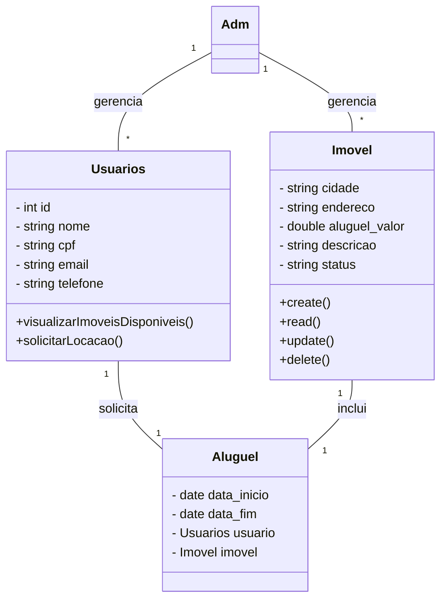
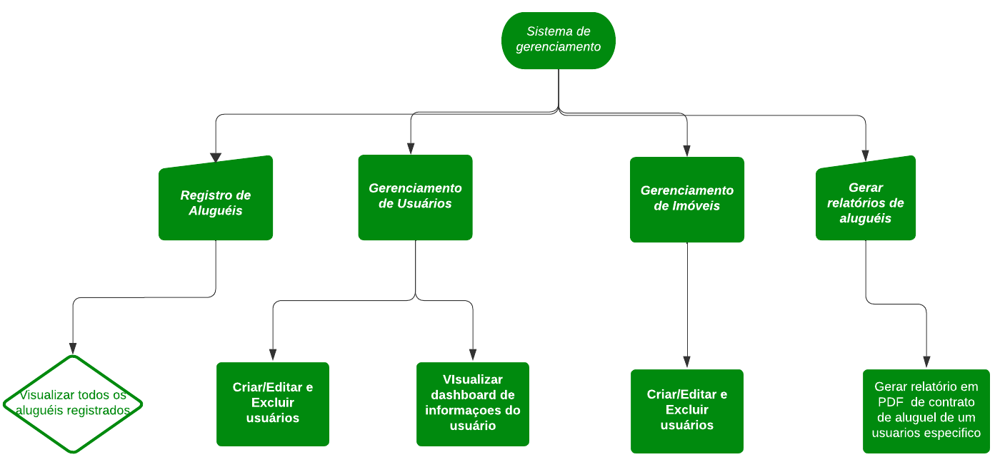

# Gerenciamento de aluguel de imóveis

#### [📝Manual do usuário](https://github.com/ryangabriel27/projeto-java-imobiliaria/blob/main/documentacao/manual_do_usuario.md)
#### [📝Relatórios de testes unitários](https://github.com/ryangabriel27/projeto-java-imobiliaria/blob/main/documentacao/testes_unitarios.md)

## 🔨 Escopo do Sistema 

O sistema será uma uma aplicação voltada para administradoras de imóveis que gerenciam diversas propriedades.O sistema permitirá o **cadastro** de `IMÓVEIS`, `USUÁRIOS` e `CONTRATOS DE LOCAÇÃO`, além de **fornecer relatórios** detalhados sobre imóveis disponíveis, locações ativas e vencimento de contratos e aluguéis. A aplicação visa simplificar o processo de gerenciamento imobiliário, oferecendo uma **interface gráfica intuitiva** e funcionalidades que garantem o controle eficiente sobre os dados cadastrados.

- ### 1. **Administrador**

    Os administradores terão controle total sobre o sistema, com as seguintes responsabilidades e funcionalidades:

    - #### 1.1. **Gerenciamento da Plataforma**
        - Administrar as operações de locação e monitoramento da atividade dos usuários.
  
    - #### 1.2. **Gerenciamento de Locações**
        - Acompanhar e aprovar as solicitações de locação de usuários.
        - Manter o controle sobre contratos de locação, incluindo datas de início e fim.

    - #### 1.3. **CRUD de Imóveis**
        - Criar, visualizar, editar e deletar imóveis no sistema.
        - Cada imóvel deve incluir cidade, endereço, valor do aluguel, descrição e status (DISPONÍVEL ou ALUGADO).
  
    - #### 1.4. **CRUD de Usuários**
        - Gerenciar os perfis de usuários, incluindo adicionar novos usuários, editar dados de perfis existentes e remover usuários.
        - Os usuários são identificados pelo CPF e possuem informações como nome, email e telefone.

- ### 2. **Usuários**

    Os usuários podem navegar e interagir com o sistema para visualizar imóveis disponíveis e solicitar locações.

    - #### 2.1. **Locação de Imóveis**
        - Os usuários podem visualizar uma lista de imóveis disponíveis para locação, com filtros por cidade e preço.
        - Solicitar a locação de um imóvel através de um sistema web, enviando uma requisição POST para a API com seus dados e a identificação do imóvel.
        - Após a aprovação da solicitação pelo administrador, será gerado um relatório que inclui detalhes sobre o imóvel alugado e as datas de início e fim da locação.

- ### 3. **Gerenciamento de Imóveis**   

    A plataforma permite que os administradores mantenham uma base de dados de imóveis, com os seguintes atributos:

    - **Cidade**: Localização do imóvel.
    - **Endereço**: Endereço completo do imóvel.
    - **Aluguel Valor**: Valor mensal do aluguel do imóvel.
    - **Descrição**: Informações adicionais sobre o imóvel.
    - **Status**: O status atual do imóvel, que pode ser "DISPONÍVEL" ou "ALUGADO".
  
    Somente administradores poderão criar ou modificar informações dos imóveis.

- ### 4. **Gerenciamento de Locações**

    As locações serão tratadas como contratos entre o usuário e a plataforma, gerenciados pelos administradores:

    - **Data de Início e Fim**: A locação terá uma data de início e uma data de fim previamente definidas.
    - **Usuário**: Cada locação estará associada a um usuário (locatário) identificado por uma chave estrangeira no banco de dados.
    - **Imóvel**: Cada locação será vinculada a um imóvel, também identificado por uma chave estrangeira.
    
    Após a confirmação da locação, será gerado um relatório com os detalhes do contrato.

- ### 5. **Relatórios de Locações**

    O sistema permitirá que relatórios sejam gerados automaticamente quando uma locação for aprovada, contendo:

    - Detalhes do imóvel alugado.
    - Informações do locatário.
    - Datas de início e fim da locação.

## 💡 Objetivos 
Desenvolver um sistema de **Gerenciamento Imobiliário**, permitindo que os administradores do sistema **cadastrem, editem e excluam** `IMÓVEIS`, `PROPRIETÁRIOS`, `USUÁRIOS` e `CONTRATOS DE LOCAÇÃO(Aluguéis)`, além de gerar **relatórios detalhados** sobre aluguéis, locações ativas e vencimento de contratos, dentro de um prazo de `4 meses`.

### 🛠 Recuros de Ferramentas
- VSCode (Desenvolvimento)
- Postman/Thunderclient (Testes de API)
- PostgreSQL (Banco de Dados)
- GitHub (Versionamento)
- Node.JS (Compilador para a API)
- Java (Desenvolvimento do sistema principal)

### Análise de Riscos
`Atrasos e Mudanças nos Requisitos:`
- Adoção de metodologias ágeis como Scrum e Kanban com reuniões frequentes.
- Elaboração de planos de contingência e comunicação clara com stakeholders.

`Problemas Técnicos e Bugs:`
- Realização de testes contínuos, revisões de código e monitoramento de falhas.

`Vulnerabilidades de Segurança:`
- Implementação de testes de segurança, atualizações constantes e controle de acesso.

`Problemas de Desempenho e Escalabilidade:`
- Testes de desempenho e otimização de recursos.

## 📊 Diagramas

- ### Diagrama de Classe 

- ### Diagrama de Uso

- ### Diagrama de Fluxo

