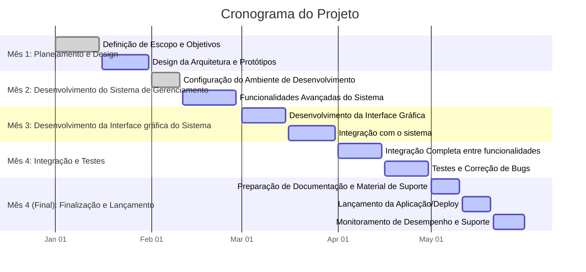
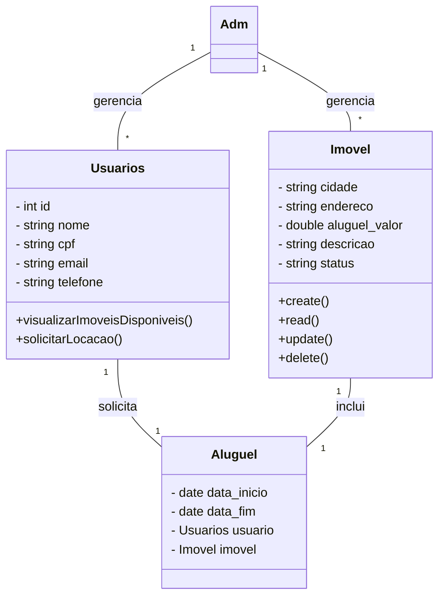
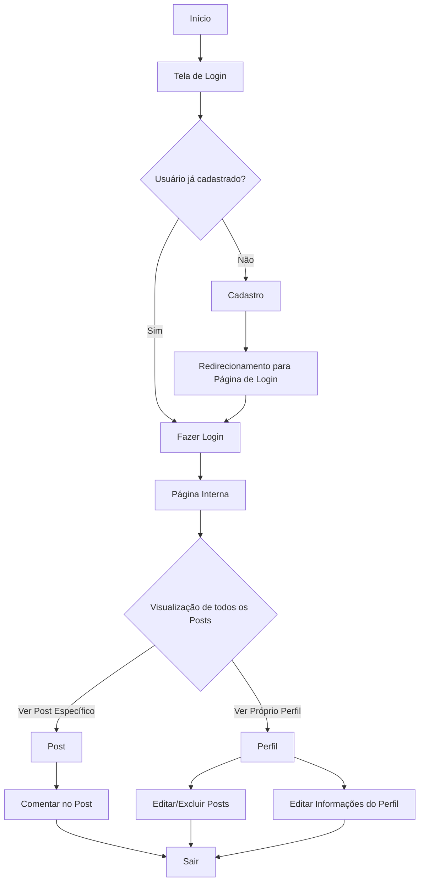

#  Gerenciamento de Propriedades Imobiliárias

## Escopo do Sistema

O sistema será uma uma aplicação voltada para administradoras de imóveis que gerenciam diversas propriedades.O sistema permitirá o **cadastro** de `IMÓVEIS`, `LOCATÁRIOS (Usuários)` e `CONTRATOS DE LOCAÇÃO`, além de **fornecer relatórios** detalhados sobre imóveis disponíveis, locações ativas e vencimento de contratos e aluguéis. A aplicação visa simplificar o processo de gerenciamento imobiliário, oferecendo uma **interface gráfica intuitiva** e funcionalidades que garantem o controle eficiente sobre os dados cadastrados.

### 1. **Funcionalidades do Administrador**

Os administradores terão controle total sobre o sistema, com as seguintes responsabilidades e funcionalidades:

#### 1.1. **Gerenciamento da Plataforma**
- Administrar as operações de locação e monitoramento da atividade dos usuários.
  
#### 1.2. **Gerenciamento de Locações**
- Acompanhar e aprovar as solicitações de locação de usuários.
- Manter o controle sobre contratos de locação, incluindo datas de início e fim.

#### 1.3. **CRUD de Imóveis**
- Criar, visualizar, editar e deletar imóveis no sistema.
- Cada imóvel deve incluir cidade, endereço, valor do aluguel, descrição e status (DISPONÍVEL ou ALUGADO).
  
#### 1.4. **CRUD de Usuários**
- Gerenciar os perfis de usuários, incluindo adicionar novos usuários, editar dados de perfis existentes e remover usuários.
- Os usuários são identificados pelo CPF e possuem informações como nome, email e telefone.

### 2. **Funcionalidades dos Usuários**

Os usuários podem navegar e interagir com o sistema para visualizar imóveis disponíveis e solicitar locações.

#### 2.1. **Locação de Imóveis**
- Os usuários podem visualizar uma lista de imóveis disponíveis para locação, com filtros por cidade e preço.
- Solicitar a locação de um imóvel através de um sistema web, enviando uma requisição POST para a API com seus dados e a identificação do imóvel.
- Após a aprovação da solicitação pelo administrador, será gerado um relatório que inclui detalhes sobre o imóvel alugado e as datas de início e fim da locação.

### 3. **Gerenciamento de Imóveis**

A plataforma permite que os administradores mantenham uma base de dados de imóveis, com os seguintes atributos:

- **Cidade**: Localização do imóvel.
- **Endereço**: Endereço completo do imóvel.
- **Aluguel Valor**: Valor mensal do aluguel do imóvel.
- **Descrição**: Informações adicionais sobre o imóvel.
- **Status**: O status atual do imóvel, que pode ser "DISPONÍVEL" ou "ALUGADO".
  
Somente administradores poderão criar ou modificar informações dos imóveis.

### 4. **Gerenciamento de Locações**

As locações serão tratadas como contratos entre o usuário e a plataforma, gerenciados pelos administradores:

- **Data de Início e Fim**: A locação terá uma data de início e uma data de fim previamente definidas.
- **Usuário**: Cada locação estará associada a um usuário (locatário) identificado por uma chave estrangeira no banco de dados.
- **Imóvel**: Cada locação será vinculada a um imóvel, também identificado por uma chave estrangeira.
  
Após a confirmação da locação, será gerado um relatório com os detalhes do contrato.

### 5. **Relatórios de Locações**

O sistema permitirá que relatórios sejam gerados automaticamente quando uma locação for aprovada, contendo:

- Detalhes do imóvel alugado.
- Informações do locatário.
- Datas de início e fim da locação.

## Objetivos
Desenvolver um sistema de **Gerenciamento Imobiliário**, permitindo que os administradores de propriedades **cadastrarem, editem e excluam** `IMÓVEIS`, `PROPRIETÁRIOS`, `LOCATÁRIOS` e `CONTRATOS DE LOCAÇÃO`, além de gerar **relatórios detalhados** sobre imóveis disponíveis, locações ativas e vencimento de contratos, dentro de um prazo de `4 meses`.

## Objetivos Específicos

- **Desenvolver e Implementar o Sistema de Cadastro de Imóveis, Proprietários, Locatários e Contratos de Locação**

- **Desenvolver Funcionalidades de Relatórios**

- **Criar uma Interface de Usuário Intuitiva e Responsiva**

- **Implementar Sistema de Testes e Garantia de Qualidade**

- **Realizar o Deploy e Lançamento do Sistema**
### Mensuráveis

- **Cadastro de Imóveis, Proprietários, Locatários e Contratos de Locação**:

- **Geração de Relatórios**

- **Conexão com base de dados**

- **Interface de Usuário**

- **Testes e Qualidade**
  
- **Deploy e Documentação**

### Atingíveis

  - Utilizar bibliotecas como **JavaFX** para a interface gráfica e **JDBC** para persistência de dados.
  - Utilizar bibliotecas confiáveis para geração de relatórios em **PDF**, como **JasperReports**.  
  - Alocar tempo suficiente para o desenvolvimento das principais funcionalidades e para a realização de testes e correções de bugs.
  - Garantir que o deploy seja feito de forma eficiente e que o sistema esteja pronto para uso por administradoras de imóveis.

### Relevantes

- `Cadastro e Gerenciamento de Dados`: Essencial para o funcionamento do sistema, permitindo o controle de imóveis, proprietários, locatários e contratos.

- `Geração de Relatórios`: Relatórios claros são fundamentais para a administração das propriedades e o acompanhamento de vencimentos de contratos e aluguéis.

- `Interface de Usuário (UX/UI)`: Crucial para a experiência do usuário, garantindo que o sistema seja fácil de usar e funcione bem em diferentes resoluções.

- `Testes`: Garantem a confiabilidade do sistema e a minimização de erros críticos durante a operação.

- `Deploy`: Importante para garantir que o sistema esteja disponível e operacional para os usuários finais.

### Planejamento e Cronograma:

`Mês 1: Planejamento e Design`

**Definição de Escopo e Objetivos:**
- Reuniões com stakeholders para definir escopo, objetivos e requisitos.
- Elaboração de documentos de requisitos e planejamento.

**Design da Arquitetura e Protótipos:**
- Desenvolvimento da arquitetura do sistema.
- Criação de protótipos de média e alta fidelidade.
- Definição de tecnologias e planejamento da infraestrutura.

`Mês 2: Desenvolvimento do Sistema de Gerenciamento`

**Configuração do Ambiente de Desenvolvimento e Funcionalidades Básicas:**
- Configuração do ambiente de desenvolvimento com ferramentas Java.
- Implementação de funcionalidades básicas, como autenticação de usuários e persistência de dados com JPA/Hibernate.

**Funcionalidades Avançadas do Sistema:**
- Desenvolvimento de APIs para gerenciamento de imóveis, proprietários, locatários e contratos de locação.
- Implementação de lógica de negócios para controle de vencimentos de contratos e geração de relatórios.

`Mês 3: Desenvolvimento da Interface Gráfica do Sistema`

**Desenvolvimento da Interface Gráfica:**
- Criação de telas para cadastro e gerenciamento de imóveis, proprietários, locatários e contratos.
- Implementação de funcionalidades para visualização de relatórios.

**Integração com o sistema:**
- Conexão da interface gráfica com as funcionalidades do sistema.
- Implementação de funcionalidades de interação com banco de dados.

`Mês 4: Integração e Testes`

**Integração Completa:**
- Conectar todas as funcionalidades do sistema.

**Testes e Correção de Bugs:**
- Realização de testes unitários e testes de integração.
- Correção de problemas encontrados durante os testes.

`Mês 4 (Final): Finalização e Lançamento`

**Documentação e Suporte:**
- Preparação de documentação técnica e manual do usuário.
- Finalização de relatórios e dashboards.
  
**Lançamento e Monitoramento:**
- Configuração do ambiente de produção e lançamento da aplicação.
- Monitoramento do desempenho e suporte técnico pós-lançamento.

### Diagrama Gantt

### Recuros de Ferramentas
- VSCode (Desenvolvimento)
- Postman/Thunderclient (Testes de API)
- PostgreSQL (Banco de Dados)
- Java 
- GitHub (Versionamento)

### Análise de Riscos
`Atrasos e Mudanças nos Requisitos:`
- Adoção de metodologias ágeis como Scrum e Kanban com reuniões frequentes.
- Elaboração de planos de contingência e comunicação clara com stakeholders.

`Problemas Técnicos e Bugs:`
- Realização de testes contínuos, revisões de código e monitoramento de falhas.

`Vulnerabilidades de Segurança:`
- Implementação de testes de segurança, atualizações constantes e controle de acesso.

`Problemas de Desempenho e Escalabilidade:`
- Testes de desempenho e otimização de recursos.

## Diagramas

### Diagrama de Classe 

### Diagrama de Uso

### Diagrama de Fluxo

