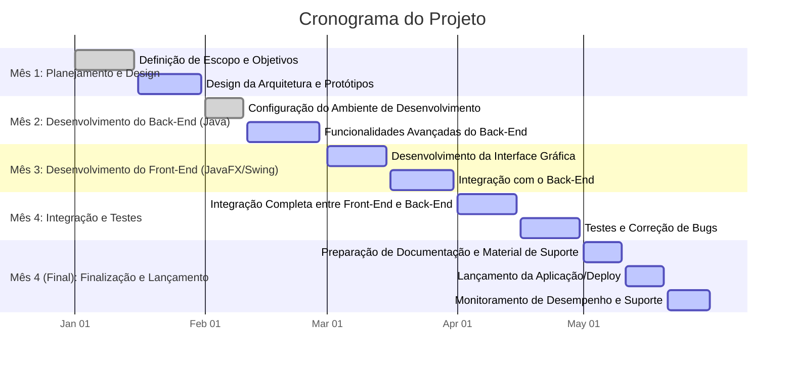
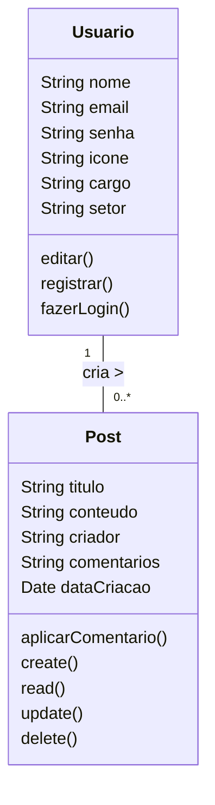
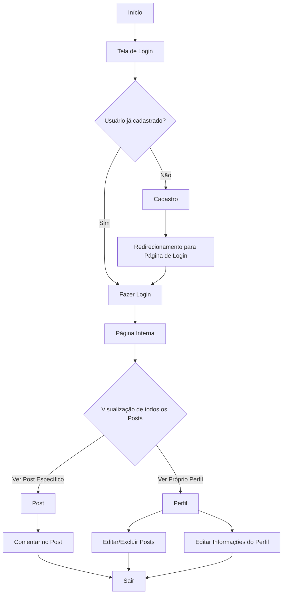

#  Gerenciamento de Propriedades Imobiliárias

## Escopo
Desenvolver uma aplicação voltada para administradoras de imóveis que gerenciam diversas propriedades. O sistema permitirá o **cadastro** de `IMÓVEIS`, `PROPRIETÁRIOS`, `LOCATÁRIOS` e `CONTRATOS DE LOCAÇÃO`, além de **fornecer relatórios** detalhados sobre imóveis disponíveis, locações ativas e vencimento de contratos e aluguéis. A aplicação visa simplificar o processo de gerenciamento imobiliário, oferecendo uma **interface gráfica intuitiva** e funcionalidades que garantem o controle eficiente sobre os dados cadastrados.

## Objetivos
Desenvolver um sistema de **Gerenciamento Imobiliário**, permitindo que os administradores de propriedades **cadastrarem, editem e excluam** `IMÓVEIS`, `PROPRIETÁRIOS`, `LOCATÁRIOS` e `CONTRATOS DE LOCAÇÃO`, além de gerar **relatórios detalhados** sobre imóveis disponíveis, locações ativas e vencimento de contratos, dentro de um prazo de `4 meses`.

## Objetivos Específicos

- **Desenvolver e Implementar o Sistema de Cadastro de Imóveis, Proprietários, Locatários e Contratos de Locação**

- **Desenvolver Funcionalidades de Relatórios**

- **Criar uma Interface de Usuário Intuitiva e Responsiva**

- **Implementar Sistema de Testes e Garantia de Qualidade**

- **Realizar o Deploy e Lançamento do Sistema**
### Mensuráveis

- **Cadastro de Imóveis, Proprietários, Locatários e Contratos de Locação**:

- **Geração de Relatórios**

- **Conexão com base de dados**

- **Interface de Usuário**

- **Testes e Qualidade**
  
- **Deploy e Documentação**

### Atingíveis

  - Utilizar bibliotecas como **JavaFX** para a interface gráfica e **JDBC** para persistência de dados.
  - Utilizar bibliotecas confiáveis para geração de relatórios em **PDF**, como **JasperReports**.  
  - Alocar tempo suficiente para o desenvolvimento das principais funcionalidades e para a realização de testes e correções de bugs.
  - Garantir que o deploy seja feito de forma eficiente e que o sistema esteja pronto para uso por administradoras de imóveis.

### Relevantes

- `Cadastro e Gerenciamento de Dados`: Essencial para o funcionamento do sistema, permitindo o controle de imóveis, proprietários, locatários e contratos.

- `Geração de Relatórios`: Relatórios claros são fundamentais para a administração das propriedades e o acompanhamento de vencimentos de contratos e aluguéis.

- `Interface de Usuário (UX/UI)`: Crucial para a experiência do usuário, garantindo que o sistema seja fácil de usar e funcione bem em diferentes resoluções.

- `Testes`: Garantem a confiabilidade do sistema e a minimização de erros críticos durante a operação.

- `Deploy`: Importante para garantir que o sistema esteja disponível e operacional para os usuários finais.

### Planejamento e Cronograma:

`Mês 1: Planejamento e Design`

**Definição de Escopo e Objetivos:**
- Reuniões com stakeholders para definir escopo, objetivos e requisitos.
- Elaboração de documentos de requisitos e planejamento.

**Design da Arquitetura e Protótipos:**
- Desenvolvimento da arquitetura do sistema.
- Criação de protótipos de média e alta fidelidade.
- Definição de tecnologias e planejamento da infraestrutura.

`Mês 2: Desenvolvimento do Sistema de Gerenciamento`

**Configuração do Ambiente de Desenvolvimento e Funcionalidades Básicas:**
- Configuração do ambiente de desenvolvimento com ferramentas Java.
- Implementação de funcionalidades básicas, como autenticação de usuários e persistência de dados com JPA/Hibernate.

**Funcionalidades Avançadas do Sistema:**
- Desenvolvimento de APIs para gerenciamento de imóveis, proprietários, locatários e contratos de locação.
- Implementação de lógica de negócios para controle de vencimentos de contratos e geração de relatórios.

`Mês 3: Desenvolvimento da Interface Gráfica do Sistema`

**Desenvolvimento da Interface Gráfica:**
- Criação de telas para cadastro e gerenciamento de imóveis, proprietários, locatários e contratos.
- Implementação de funcionalidades para visualização de relatórios.

**Integração com o sistema:**
- Conexão da interface gráfica com as funcionalidades do sistema.
- Implementação de funcionalidades de interação com banco de dados.

`Mês 4: Integração e Testes`

**Integração Completa:**
- Conectar todas as funcionalidades do sistema.

**Testes e Correção de Bugs:**
- Realização de testes unitários e testes de integração.
- Correção de problemas encontrados durante os testes.

`Mês 4 (Final): Finalização e Lançamento`

**Documentação e Suporte:**
- Preparação de documentação técnica e manual do usuário.
- Finalização de relatórios e dashboards.
  
**Lançamento e Monitoramento:**
- Configuração do ambiente de produção e lançamento da aplicação.
- Monitoramento do desempenho e suporte técnico pós-lançamento.

### Diagrama Gantt

### Recursos Humanos
- Gerente de Projetos
- Desenvolvedor Back-End (Node.js) - Pleno
- Desenvolvedor Front-End (React) - Pleno
- DBA (Banco de Dados) - Pleno
- QA (Qualidade de Software) - Pleno
- Especialista em Segurança da Informação
- Estagiário em DEV (Documentação)

### Recuros de Ferramentas
- JIRA (Organização)
- VSCode (Desenvolvimento)
- Figma/Adobe (Design)
- Postman (Testes de API)
- GitHub Actions (CI/CD)
- MongoDB (Banco de Dados)
- React (Front-End)
- Node.js/Next.js (Back-End)

### Análise de Riscos
`Atrasos e Mudanças nos Requisitos:`
- Adoção de metodologias ágeis como Scrum e Kanban com reuniões frequentes.
- Elaboração de planos de contingência e comunicação clara com stakeholders.

`Problemas Técnicos e Bugs:`
- Realização de testes contínuos, revisões de código e monitoramento de falhas.

`Vulnerabilidades de Segurança:`
- Implementação de testes de segurança, atualizações constantes e controle de acesso.

`Problemas de Desempenho e Escalabilidade:`
- Testes de desempenho e otimização de recursos.

## Diagramas

### Diagrama de Classe 

### Diagrama de Uso
 

### Diagrama de Fluxo

## Protótipo da pagina principal de Posts:

- ### Baixa Fidelidade:
 

- ### Média Fidelidade:
 

- ### Alta Fidelidade:
 

