# Manual para o usuário

- ### 1. Recursos necessários para a utilizar a aplicação:
    - Visual Studio Code
    - PostgreSQL (pgAdmin)
    - JDK versão 17
    - Node.JS, optar pela versão LTS mais recente
    - Acesso a internet para baixar as dependências
    - Extension Pack for Java (VSCode)

    #### Certifique-se de estar com o ambiente devidamente configurado, por exemplo, as váriaveis de ambiente.

- ### 2. Instalação:
    - #### Clonar o repositório:
        ```
        git clone https://github.com/ryangabriel27/projeto-java-imobiliaria
        ```
    - #### Após fazer o clone, Crie o banco de dados:
        - #### Vá até o pgAdmin e execute a seguinte query:
        ```
        CREATE DATABASE projeto_java_imobiliaria;
        ```
    - #### Instalar as dependências:
        - #### Dentro do repositório, pode ver que a aplicação completa está dividida em 3 diretórios principais:
            - ##### 1. `app` (Diretório que está a aplicação JAVA, responsavél por gerenciar todos as classes e itens que estão cadastrados no banco de dados)
            - ##### 2. `api-imobiliaria` (Diretório que está a API responsavel por registrar alugueis de clientes)
            - ##### 3. `view-imobiliaria` (Diretório que está a aplicação web feita para que os cliente vejam e solicitem seus aluguéis)
        - #### Para navegar até `api-imobiliaria` digite no console :
        ```
        cd .\api-imobiliaria\
        ```
        - #### Depois instale as dependências necessárias:
        ```
        npm install
        ```
        - #### Faça também as devidas configurações para o arquivo .env, que está na raiz deste diretório (exemplo):
        ```
        DB_USER="postgres"
        DB_HOST="localhost"
        DB_NAME="projeto_java_imobiliaria"
        DB_PASSWORD="sua senha para o banco de dados"
        DB_PORT=5432
        PORT=5000
        ```
        - #### Por fim, execute o servidor:
        ```
        node server.js
        ```
        - #### "Crie" outro terminal para que a API continue rodando
        - 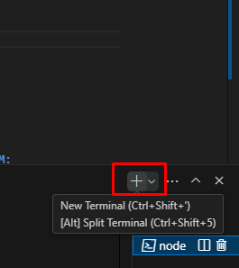
        - #### Agora, retorne a raiz do projeto e navegue até o diretório `view-imobiliaria`:
        ```
        cd..

        cd .\view-imobiliaria\
        ```
        - #### Dentro do diretório apenas repita o comando para instalar as dependências com o NPM:
        ```
        npm install
        ```
        - #### **IMPORTANTE**:
            - #### Verifique os arquivos localizados em `view-imobiliaria\src\components`:
                - #### `TelaInicial.js`:
                    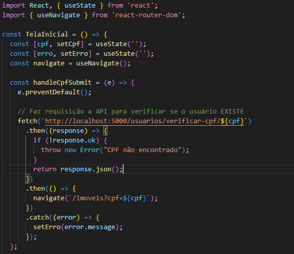
                - #### `TelaImoveis.js`:
                    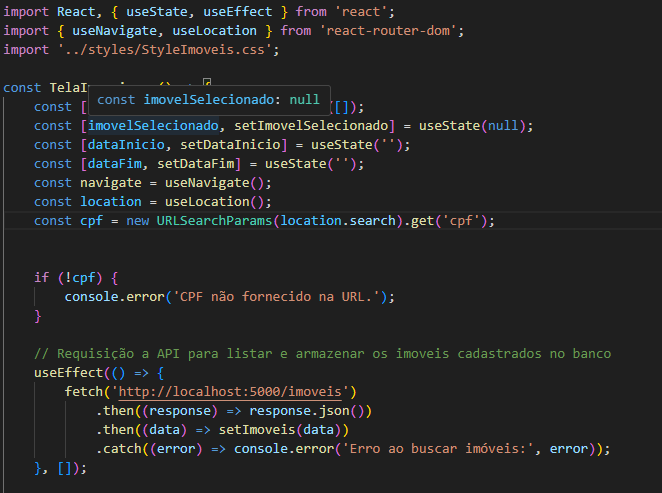
                    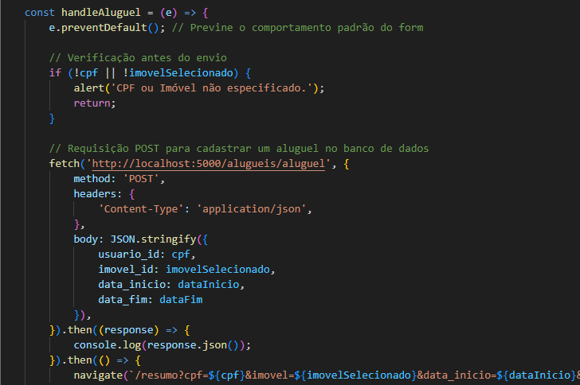
                - #### Certifique-se de que o endereço e porta da API estejam conforme as suas configurações definidas no .env
        - #### Por fim, execute a aplicação (OBS: ainda não utilize, até concluir a instalação completa do projeto):
        ```
        npm start
        ```
    - #### Executar a aplicação java `app`:
        - #### Na raiz do projeto procure pelo arquivo `Main.java`:
            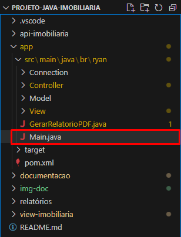
        - #### Depois execute o projeto:
            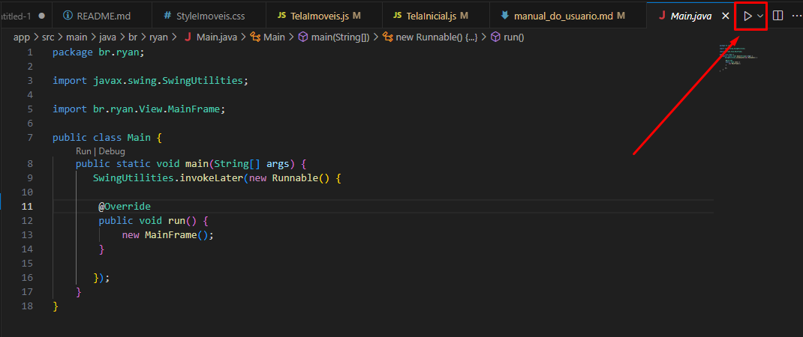
        - #### Se tudo correr bem, a aplicação abrirá na tela inicial, e a instalação está pronta!:
            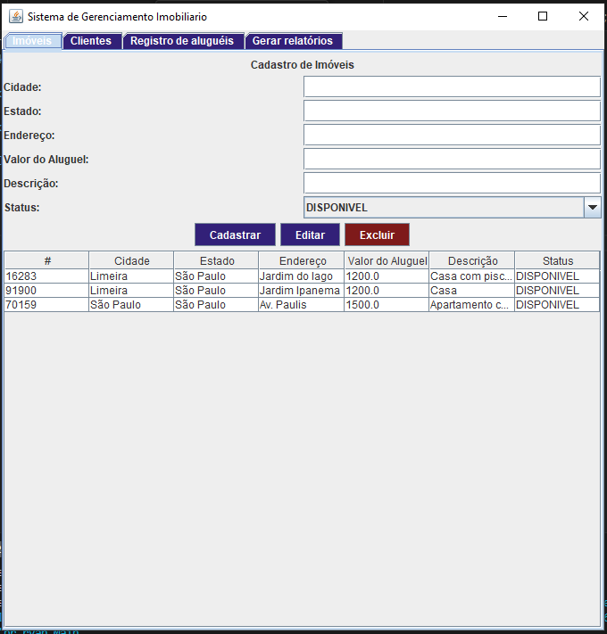
- ### 3. Funcionalidades
    - #### 3.1 Aplicação JAVA (Gerenciamento):
        - #### A aplicação tem 4 telas principais: Gerenciamento de Imóveis, Gerenciamento de Clientes/Usuários, Registro de Aluguéis e Gerar Relatórios.
        - #### 3.1.1 - Gerenciamento de Imóveis
            - 
            - ##### Nessa aba é possível realizar o cadastro, edição e exclusão de imóveis.
            - ##### Para cadastrar é simples basta preencher adequadamente os campos informados e clicar no botão 'CADASTRAR'
            - ##### Para realizar as edições e exclusões basta selecionar o item presente na tabela abaixo, assim que selecionado suas informações serão colocadas nos campos e ali podem ser alterados. Se desejar editar altere a informação e clique em 'EDITAR', caso queira excluir cliquem em 'EXCLUIR' e confirme a exclusão.
            - #### Exemplo:
                - ##### Selecionando o imóvel desejado
                - 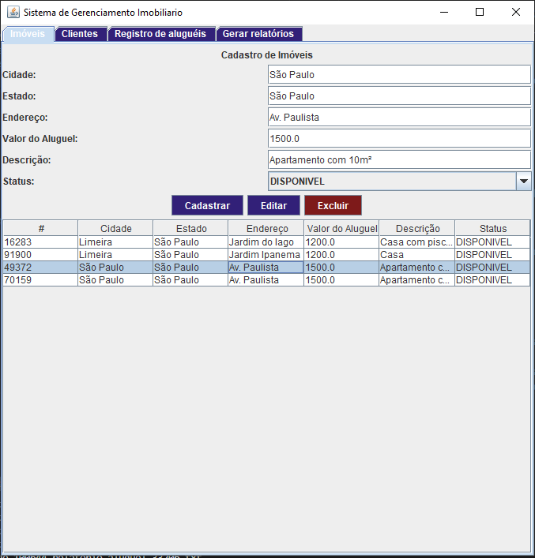
                - ##### Alterando o campo desejado e clicando em 'EDITAR'
                - 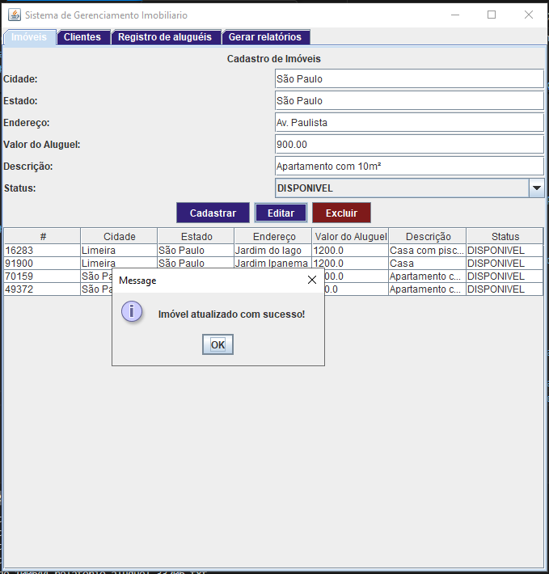 
                - ##### Imóvel atualizado listado na tabela.
                - 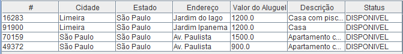 
        - #### 3.1.2 - Gerenciamento de Clientes/Usuários
            - 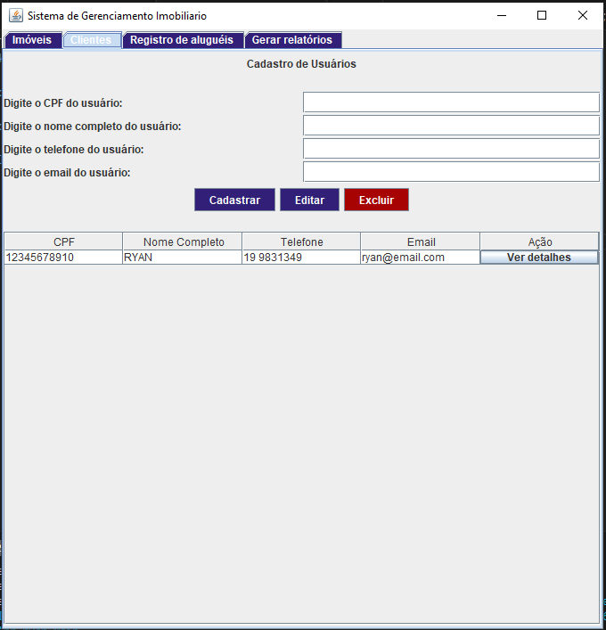
            - ##### O gerenciamento funciona da mesma maneira que o gerenciamento de imóveis, o diferencial é um botão anexado a tabela, que mostra um sumário dos dados do usuário relacionados aos alugueis
            - 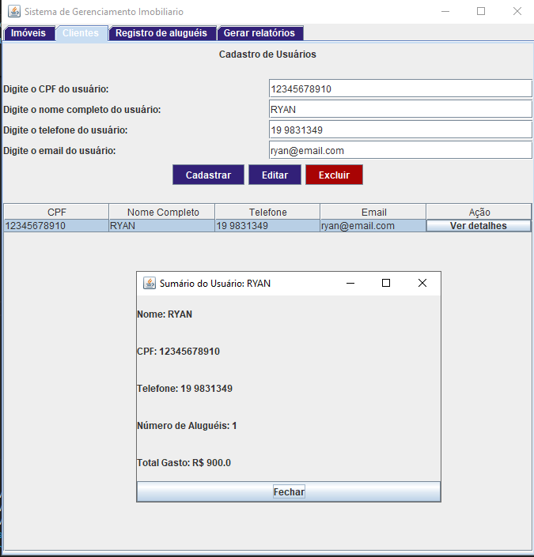
            - ##### No sumário podemos ver o total gasto (contado por valor de aluguel), e número de alugueis realizados.
        - #### 3.1.3 - Registro de Alugueis
            - 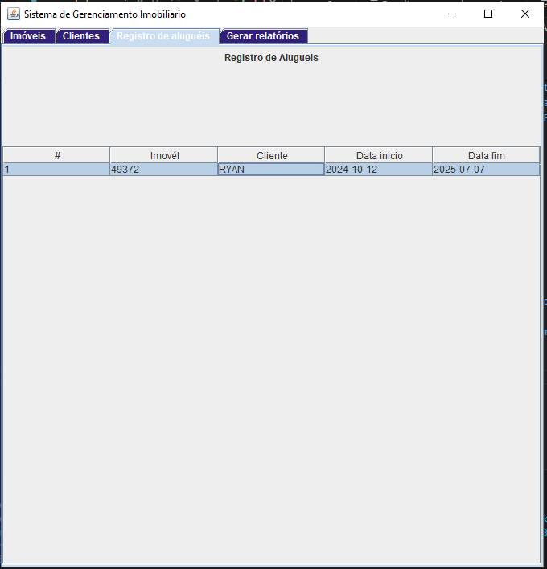
            - ##### Aqui temos uma tabela simples, onde consta todos os registros de alugueis ja feitos pela imobiliaria.
        - #### 3.1.4 - Gerar Relatórios
            - 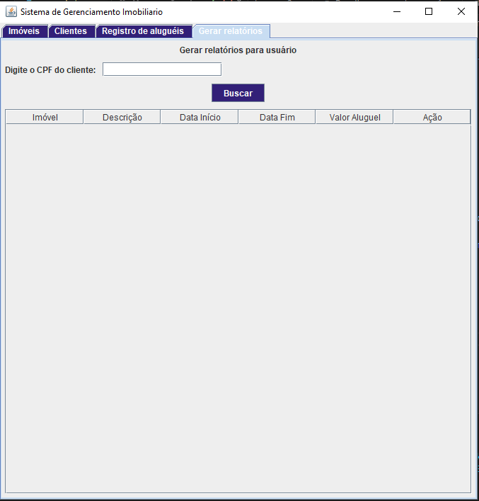
            - ##### Nesta aba temos a funcionalidade de verificar os alugueis feitos por um usuário e gerar relatórios em arquivos PDF que podem ser encaminhados ao cliente.
            - ##### Para procurar basta colocar os números de CPF do usuário e, caso encontrado, será listado seus alugueis logo abaixo. Para gerar o relatório basta clicar no botão anexado a linha da tabela, os arquivos são salvos no diretório `relatórios` localizado na raiz do projeto, o arquivo tem com o código id do imóvel em seu titulo
            - ### IMPORTANTE
                - #### Para configurar corretamente o diretório, procure a classe `GerarRelatorioPDF.java`
                - 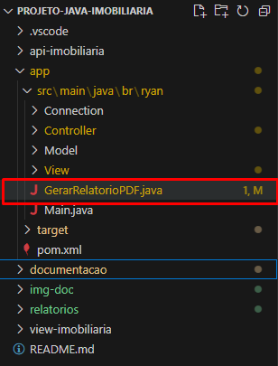
                - #### Procure pela linha 83 e coloque o diretório correto
                - 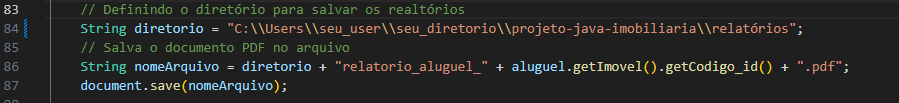
                - #### Dica:
                - #### Utilize a função do VSCode para copiar o caminho do diretório e substitua no código
                - 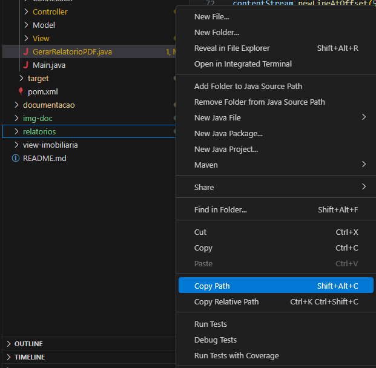
            - ##### EXEMPLO:
                - ##### Buscando o usuario..
                - 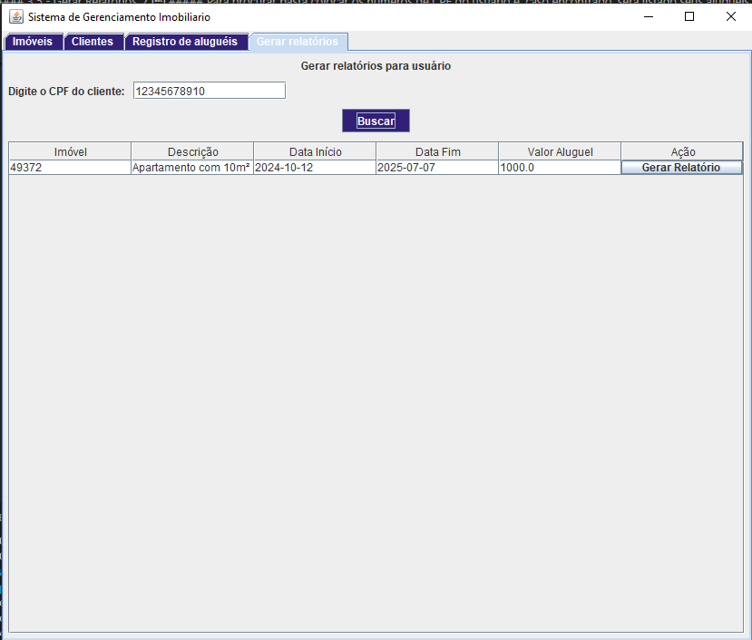
                - ##### Gerando relatório...
                - 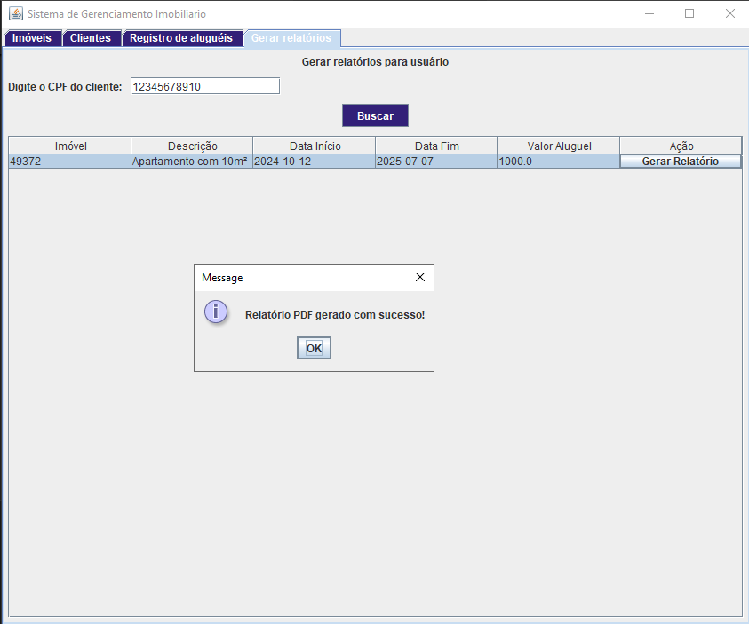
                - ##### Relatório salvo com sucesso..
                - 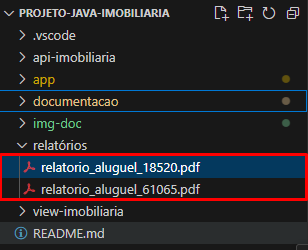
    - #### 3.2 Aplicação WEB (API e Front-END)
        - ##### Verifique se a API e o `view-biblioteca` ainda estão rodando, caso não as inicie novamente por favor
        - #### Após iniciar abra seu navegador favorito e digite pelo endereço `http://localhost:3000`
        - #### Assim que carregar, estará na tela inicial onde deve inserir o cpf de um usuário cadastrado no sistema
        - 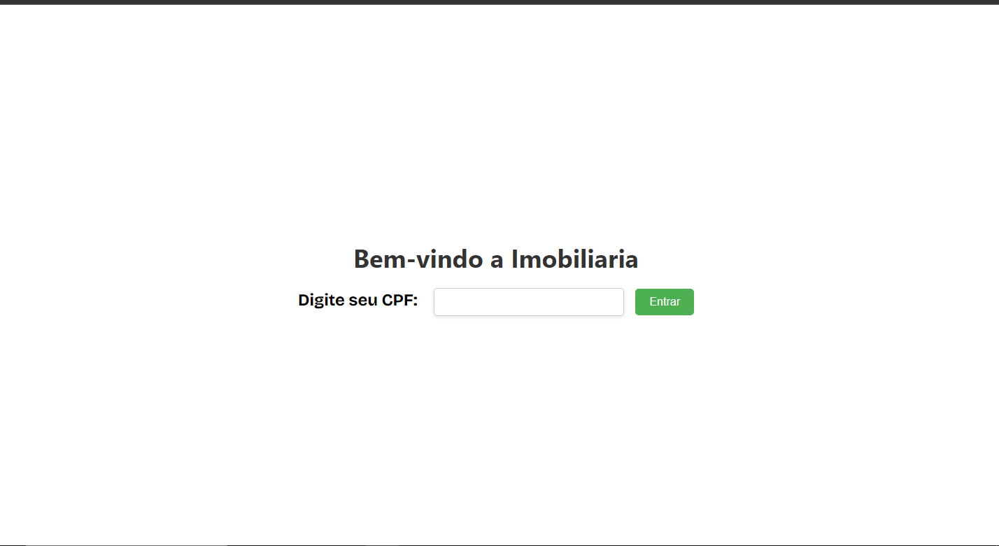
        - #### Insira o cpf e clique em 'ENTRAR' para verificar os Imóveis disponiveis
        - 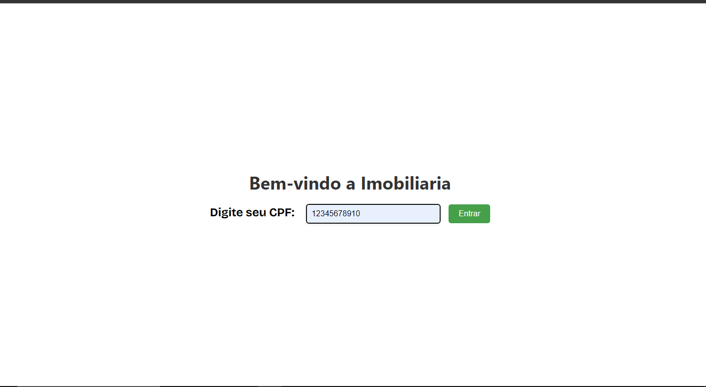
        - #### Se o usuário estiver cadastrado será redirecionado a página de imóveis
        - 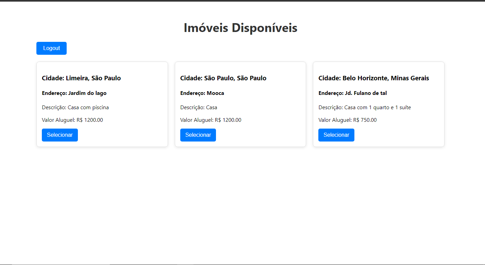
        - #### Nesta página o cliente deve escolher o imóvel que deseja e, depois, selecionar a data de inicio e fim do aluguel e solicitar esse aluguel.
        - 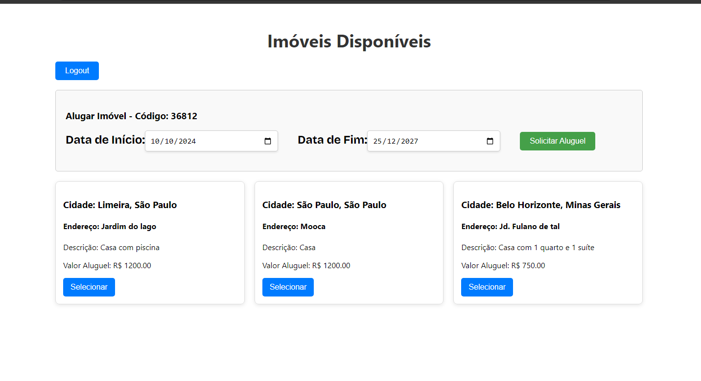
        - #### Após solicitado o aluguel será registrado na base de dados e o imóvel terá seu STATUS alterado para ALUGADO.
        - #### Obs: O aluguel é apenas feito com dados válidos para datas, ou seja, inicio a partir do dia de solicitação e fim após o dia de inicio.
        - 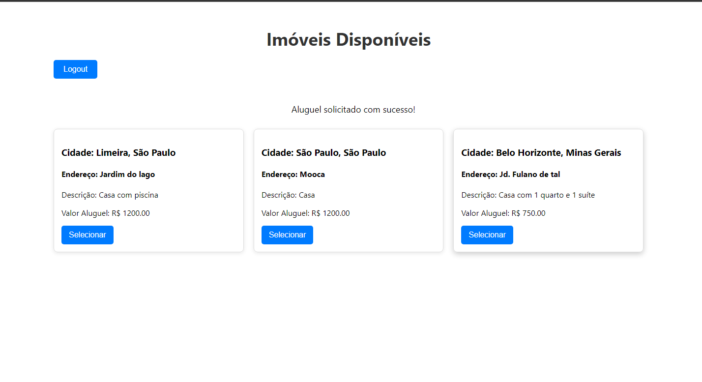
        - #### Após solicitado o aluguel será registrado na base de dados e o imóvel terá seu STATUS alterado para ALUGADO.
        - 
        - #### Imóveis alugados não são listados na página
        - 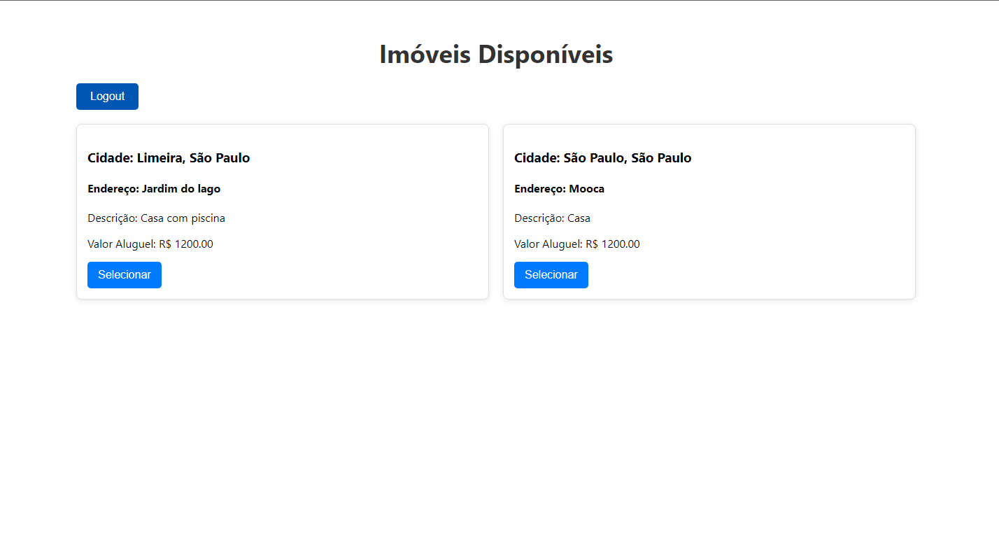
        - #### Por fim, apenas clicar em `Logout` para sair e voltar à tela inicial
        - ##### OBS: Caso os dados não seja atualizados automaticamente na aplicação JAVA, favor reiniciar.

            
                
