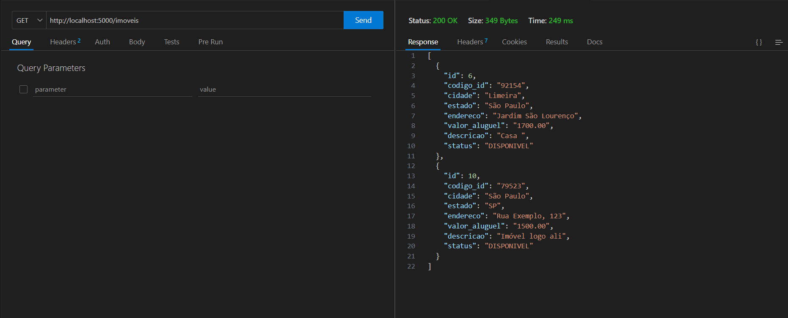
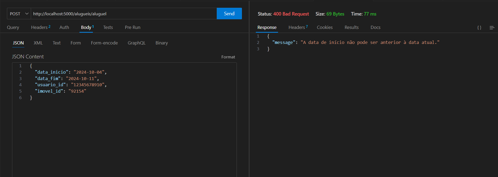
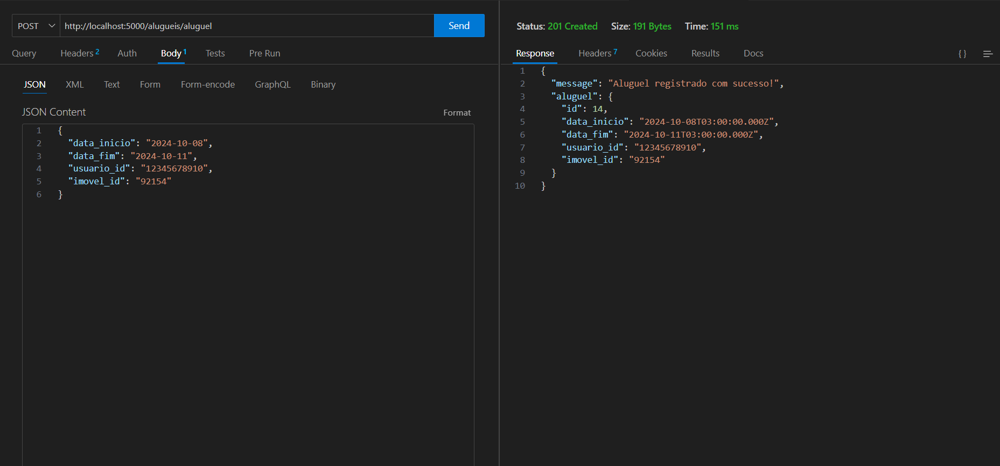
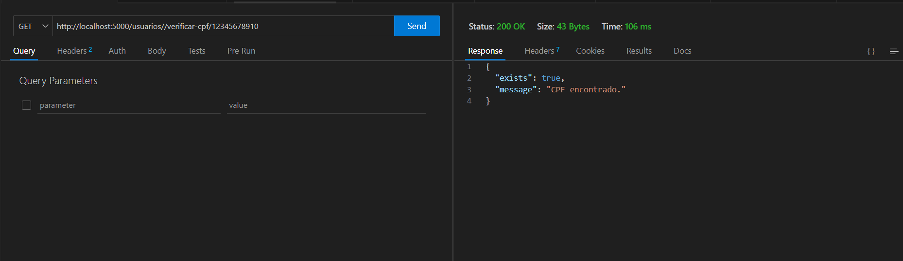

# Documento de Teste Unitarios
- ## Testes Unitários utilizando Mockito e JUnit:
    - ### [TesteImovelController](../app/target/surefire-reports/TestImovelService.txt)
    - ### [TesteUsuarioController](../app/target/surefire-reports/TestUsuarioService.txt)
- ## Testes API:
    - #### Listar todos imóveis DISPONIVEIS 
        - 

    - #### Registrar um aluguel
        - ##### Tentativa de registro com erro
        - 
        - ##### Tentativa de registro com sucesso
        - 
    
    - ### Verifica se o CPF do usuário está cadastrado
        - 